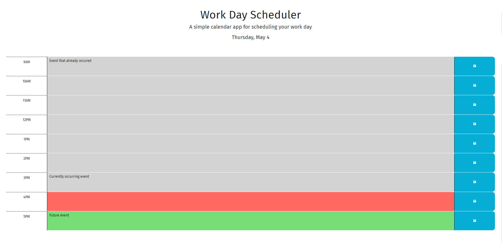

# challenge-5: work Day Scheduler

Link to live website: https://joshualam071522.github.io/challenge-5/

Description

The purpose of this project was to build a scheduler to keep track of tasks to do during your workday.
By doing this, I was able to apply my knowledge on the use of Third party APIs. The main ones I used in this project include Jquery, Bootstrap, and Dayjs. I used Jquery and dayjs to build the logic and functionality of my webpage, while I used Bootstrap to create premade styling for my webpage. I also used google fonts to add even more styling using a third party API.

Installation

N/A

Usage

Under the title workday Scheduler, you should see today's date. To use the work day scheduler, All you have to do is click anywhere inside a timebox you want to assign a task to. From there, you will be able to type in the task. After you are done with that, press the blue save button on the right, so when you come back to the website, the task will still be there. The task will not disappear until you delete the task yourself and save, or go to the localStorage in your console and delete the key. When the timebox is grey, that means that the time has already passed for that day. If the timebox is red, it will mean that the time for the task in the red box is in the current hour. And if it is green, it is a future task.

Credits N/A

License MIT License

Copyright (c) 2023 Joshua Lam

Permission is hereby granted, free of charge, to any person obtaining a copy of this software and associated documentation files (the "Software"), to deal in the Software without restriction, including without limitation the rights to use, copy, modify, merge, publish, distribute, sublicense, and/or sell copies of the Software, and to permit persons to whom the Software is furnished to do so, subject to the following conditions:

The above copyright notice and this permission notice shall be included in all copies or substantial portions of the Software.

THE SOFTWARE IS PROVIDED "AS IS", WITHOUT WARRANTY OF ANY KIND, EXPRESS OR IMPLIED, INCLUDING BUT NOT LIMITED TO THE WARRANTIES OF MERCHANTABILITY, FITNESS FOR A PARTICULAR PURPOSE AND NONINFRINGEMENT. IN NO EVENT SHALL THE AUTHORS OR COPYRIGHT HOLDERS BE LIABLE FOR ANY CLAIM, DAMAGES OR OTHER LIABILITY, WHETHER IN AN ACTION OF CONTRACT, TORT OR OTHERWISE, ARISING FROM, OUT OF OR IN CONNECTION WITH THE SOFTWARE OR THE USE OR OTHER DEALINGS IN THE SOFTWARE.

🏆 The previous sections are the bare minimum, and your project will ultimately determine the content of this document. You might also want to consider adding the following sections.

Badges N/A

Features N/A

How to Contribute N/A

Tests N/A